# Honey Pot Analysis

## Table of Content
- Introduction
- Overview
- Information About the Attack
- Conclusion 

# Introduction
This is my analysis of a honeypot I setup using T-Pot and AWS.I am using AWS to host my server
and T-POT to create the honeypot.

## T-POT 
This tool contains multiple honey pot and was developed by T-Mobile.
I hosted the honeypots on a AWS EC2 instance.This tool not only gives you multiple pre-built honeypots but as 
well as tools for you to understand what the attacker did while he was on your server.I hosted my server 
in the Vergina region

## Cowrie
Cowrie is one of the many honeypots that T-Pot offers.I will be making my analysis on this.
This honeypot is used to log SSH bruteforce attacks as well as the command the hackers run after gaining access to my server.
Cowrie can also act as a proxy for both SSH and Telnet

## AWS 
Using AWS I was able to get this honeypot up and running in a few hours. This honeypot requires pretty good hardware to
be able to run proberly so I used t3.xlarge as my instacne type.

# Overview

## Attacks
After my server went live for around 3 hours there have been more than 100 attacks already.

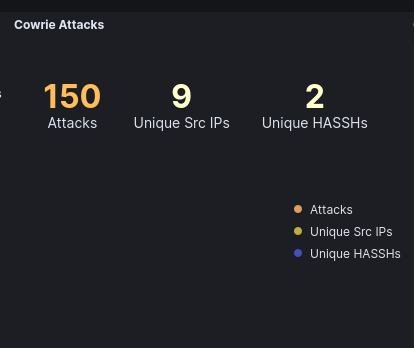

## Attacker IP
These are the IP address of attackers that created the most amount of traffic

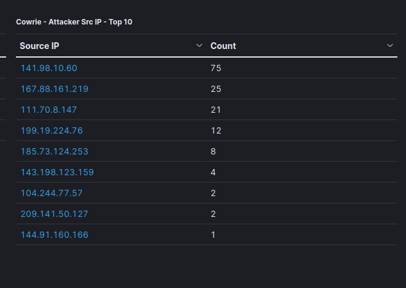

## Companies
Most if not all of these attackers used a company that offered a VPS or a web-hosting service to conduct their
attacks.These are the companies they used.

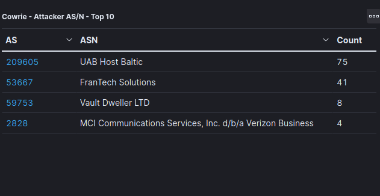

## Commands
These are the commands the attackers ran once they got access to the server

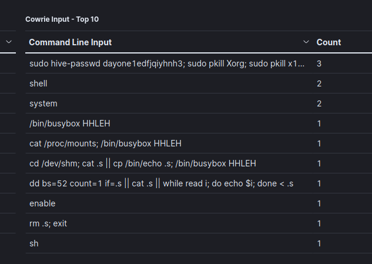

# Information About the Attack

## IP Address 141.98.10.60
### Virus Total
The results after running the IP address in virustotal

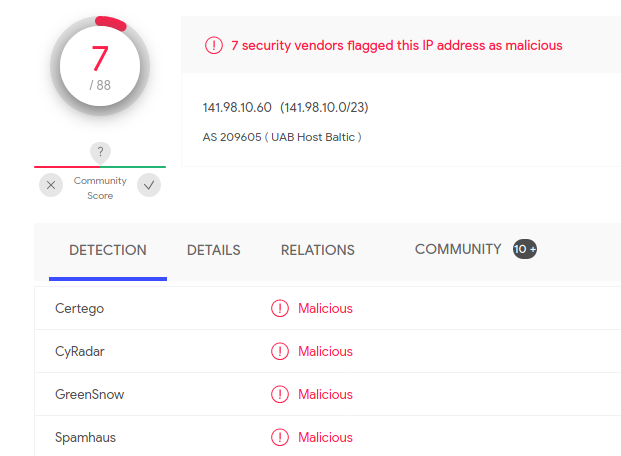

### Geolocation
This IP address is under a web-hosting Company called UAB Host Baltic.It is located in Lituania.

### Credential
The attacker gain access to my server by a brute force SSH attack.These are the usernames and password he used.
Username
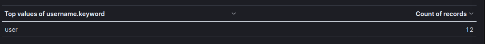

Password
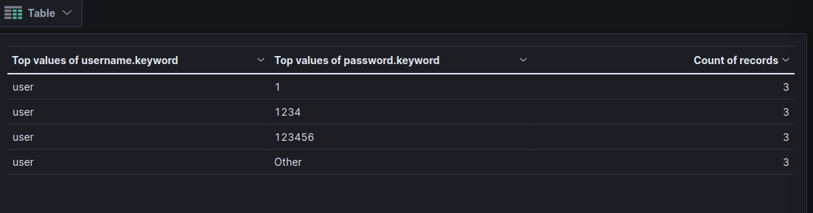

### Command
These are the commands he ran after gaining access.
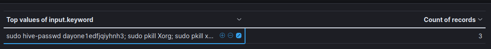
The attacker only ran 3 commands in total.The commands were also the same.Hive is a OS primiarly used for crypto mining.
He tried to change the password of a random user.After that he ran two commands to kill processes.The two processes he killed]
are responsible for the GUI interface for Linux.After that he ran the uname -a command which gave him information about the 
OS and the underlying hardware.

## IP Address 167.88.161.219
### Virus Total
The results after running the IP address in virustotal 
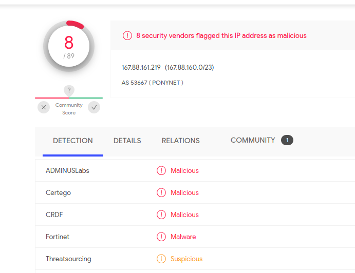

### Geolocation
The attacker is using a company that offeres VPS to conduct this attack.The company is located in Las Vegas.
Frantech has been reported to host many malicious malware.
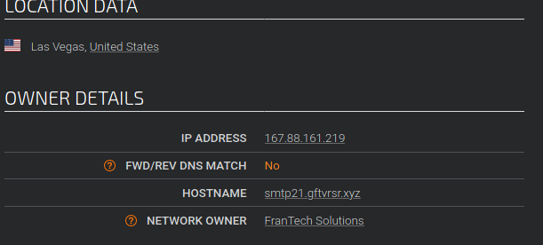

## Credential
This attacker gain access to my server by a brute force SSH attack.These are the usernames and password he used.
Username
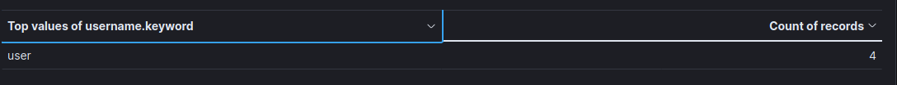

Password
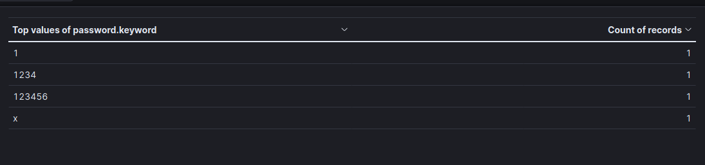

### Command
These are the commands he ran after gaining access.

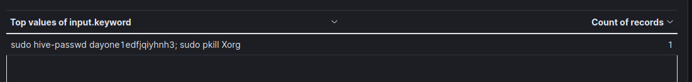

Interestingly , this attacker ran almost the same command as 141.98.10.60.They both tried to change the password
of the exact same user.They also killed the same processes.
This is probably not a concidence.It might be possible the hacker hosted his malware on multiple different
companies.

## Ip address 111.70.8.147
### Virus Total
The results after running the IP address in Virus Total

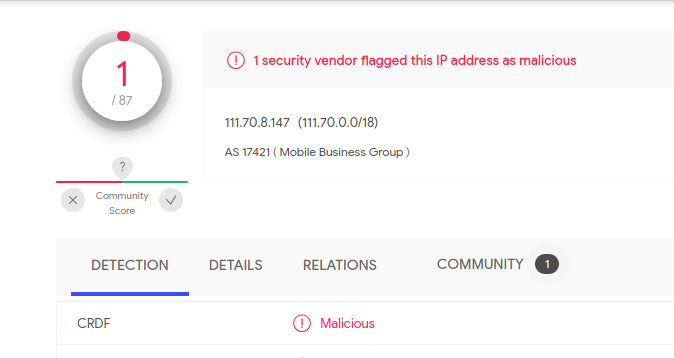

### Gelocation
This ip address is from a web-hosting service located in Taipei,Taiwan.It is a web-hosting company called
Chunghwa
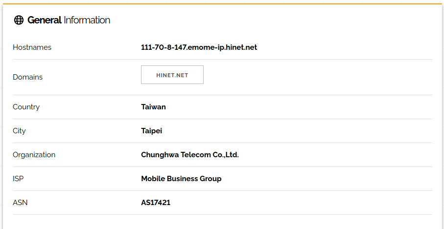

### Credential 
This attacker gain access to my server by a brute force SSH attack.These are the usernames and password he used.
Username
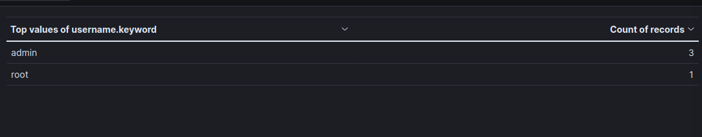

Password
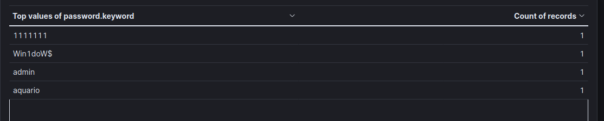

### Command
These are the commands he ran after gaining access.

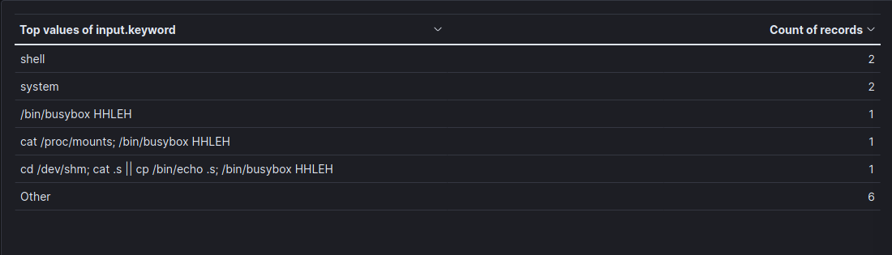

He ran two invalid linux commands.Shell and System.He also tried to cat /proc/mounts.This file contains information 
about the kernel.He also had interactions with busybox and /dev/shm.Busy box is a application that contains a 
suite of linux utilities for other systems./dev/shm contains information about temporary files.

# Conclusion 

The amount of attacks that I recieved in this short amount of time is really eye opening.Most of these
attacks now are automated and if you dont have good security measures in you application , it can really 
be hacked within just a few hours of putting it live.

The first 2 ip address was really interesting.They both ran the same command on the same user.The attacker is
using multiple servers around the world to host his malware.They seems to be infecting machines to get them to
mine crypto.They probably got information of my underlying system and felt it was unnessary to hack it.I guess
my specs is just not good enough.

